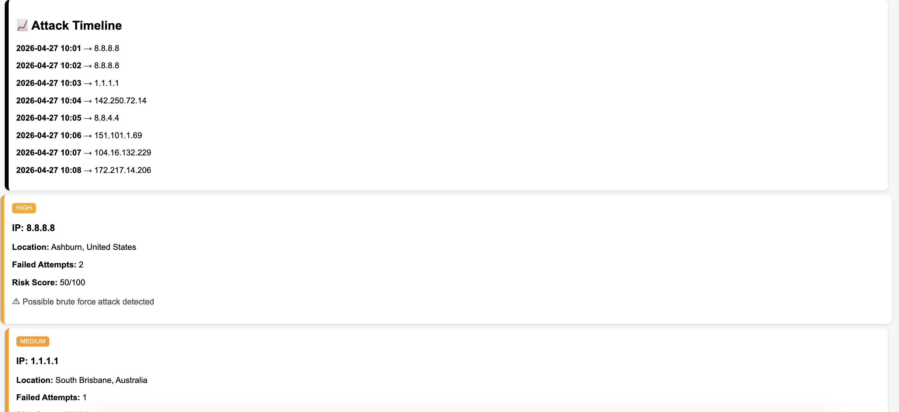
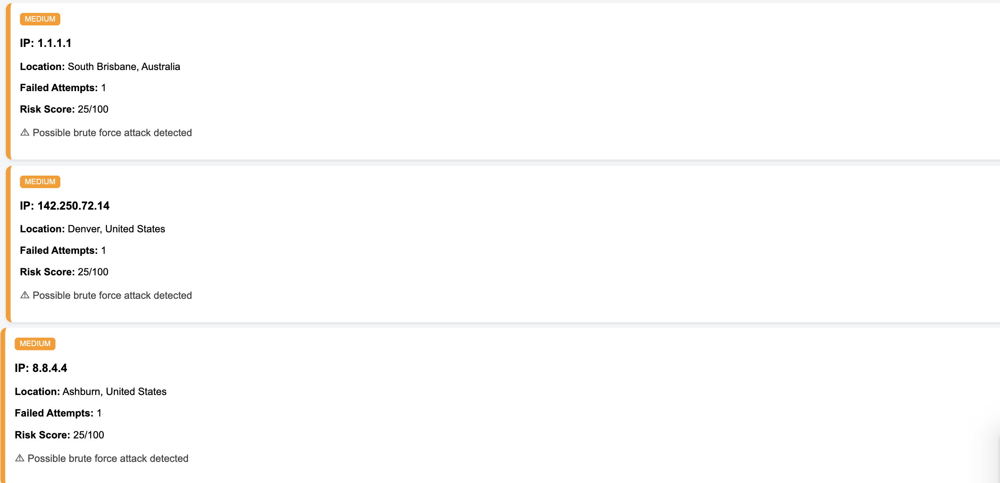
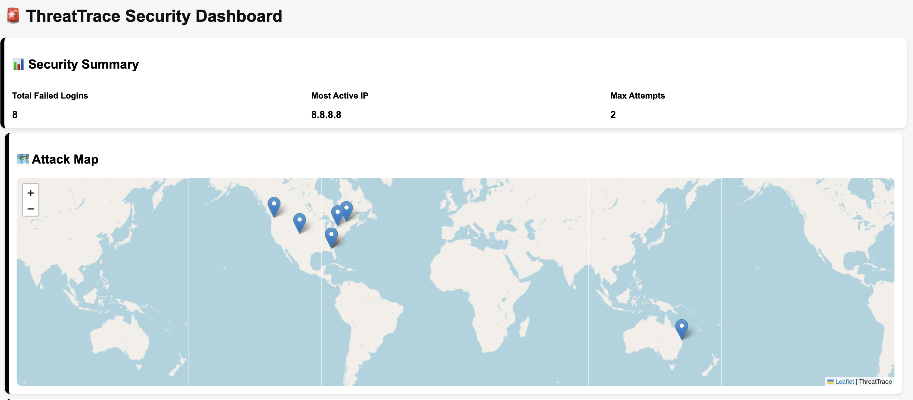
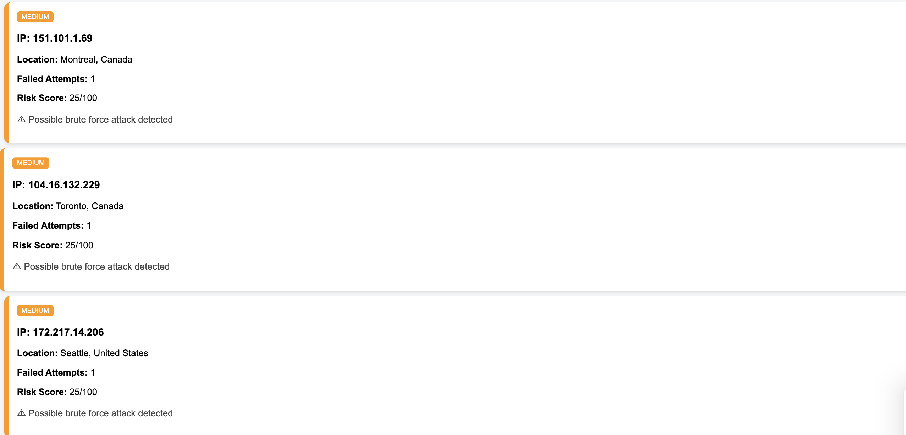

# 🚨 ThreatTrace - Cybersecurity Log Analysis & Threat Detection System

ThreatTrace is a lightweight cybersecurity monitoring tool that analyzes system logs, detects brute-force attacks, enriches data with geolocation, and visualizes threats on an interactive dashboard.

---

## 🔥 Features

- 📄 Log file parsing and analysis
- 🚨 Brute-force attack detection
- 📊 Risk scoring system (LOW / MEDIUM / HIGH / CRITICAL)
- 🌍 IP geolocation (city + country detection)
- 📈 Attack timeline visualization
- 🗺️ Interactive attack map (world view)
- 📊 Security summary dashboard
- 📄 PDF incident report generation

---

## 🧠 How It Works

1. Upload a log file
2. System parses failed login attempts
3. Detects suspicious activity per IP
4. Assigns risk score based on behavior
5. Enriches data with geolocation API
6. Displays:
   - Summary
   - Alerts
   - Timeline
   - Map visualization

---

## 🛠️ Tech Stack

- Python (Flask)
- HTML / CSS / JavaScript
- Leaflet.js (maps)
- ReportLab (PDF generation)
- OpenStreetMap API
- ip-api.com (geolocation)

---

## 📸 Screenshots

### 🖥️ Dashboard


### 📈 Attack Timeline


### 🗺️ Attack Map


### 📄 Incident Report


---

## 🚀 How to Run

```bash
pip3 install flask requests reportlab
python3 app.py